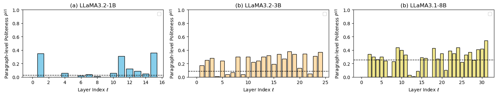

# Demystifying-Politeness-Layers

This repository accompanies the report **Investigating the Politeness
Layers in Large Language Models** for the course **Understanding LLMs** in 2025 summer semester, University of Tuebingen.\
We study whether *politeness* in large language models (LLMs) is
localized in specific layers and how those layers contribute to polite
behaviors.

## Project Member
- Keyu Wang
- Xinrui Qian
- Nongying Li
------------------------------------------------------------------------

##  Overview

Politeness is central to aligning LLMs with human values, yet its
internal mechanisms remain poorly understood.
We investigate *politeness layers* through **layer-wise ablation**
experiments across three granularities:

-   **Paragraph-level politeness** (holistic judgment of discourse)
-   **Sentence-level politeness** (frequency of polite sentences)
-   **Word-level politeness** (frequency of explicit polite markers)



Our findings show:
1. Paragraph-level politeness increases with model size, while explicit
polite markers do not.
2. Politeness-relevant signals are distributed across shallow, middle,
and deep layers.
3. First and final layers mainly control fluency, indirectly influencing
politeness.

We release code and results to enable reproducibility.

------------------------------------------------------------------------

##  Repository Structure

    repo_root/
    │
    ├── data/                # Input datasets (JSON format; not included in repo)
    │   └── text_random_50.json
    │
    ├── figures/             # Figures in the report
    |   ├── para-level.jpg
    |   ├── sent-level.jpg
    |   └── word-level.jpg
    |
    ├── results/             # Results and analysis
    │   ├── evaluation/      # Evaluation scripts & scores (gpt_eval, frequency, polite_guard_eval)
    │   ├── model_output/    # Raw model generations (baseline + pruned layers)
    │   ├── example.ipynb    # Example run
    │   └── plot.ipynb       # Visualization of layer ablation curves
    │
    ├── src/                 # Source code
    │   └── prune.py         # Utilities for layer pruning
    │
    ├── README.md            # This file
    ├── requirements.txt     # Dependencies
    └── .DS_Store


------------------------------------------------------------------------

##  Quick Start

1.  **Install dependencies**

``` bash
pip install -r requirements.txt
```

2.  **Prepare dataset**\
    Input must be a JSON file with the following schema:

``` json
{
  "model": "model_name",
  "query_id": "123",
  "answer": "Your response text here"
}
```

*(Dataset is not included. Please follow course/project instructions to
obtain it.)*

3.  **Run evaluations**

-   GPT continuous scoring

``` bash
python evaluation/gpt_eval/politeness_score_batch_chunks_resume_logged.py     --input_dir data/     --out evaluation/gpt_eval/scores-1B.csv     --model gpt-4o-mini     --chunk_size 100     --rpm 200
```

-   Frequency-based scoring

``` bash
python evaluation/frequency/gpt_politeword_freq.py     --input_dir data/     --out evaluation/frequency/scores-1B-sentence.csv     --model gpt-4o-mini
```

-   Polite-Guard evaluation

``` bash
python evaluation/polite_guard_eval/run_eval.py     --input_dir data/     --out evaluation/polite_guard_eval/scores-1B.csv
```

4.  **Visualize** Open `plot.ipynb` to reproduce layer ablation curves
    and comparisons.

------------------------------------------------------------------------

##  Outputs

-   `scores-*.csv` → per-response politeness scores\
-   `Average_score_*.csv` → aggregated scores per model\
-   `model_output/` → raw generations for case studies\
-   `plot.ipynb` → figures for paper reproduction

------------------------------------------------------------------------

##  Model Outputs

We release raw generations from pruned models to support **case
studies** and **layer ablation analysis**.

-   Located in `results/model_output/`\
-   Organized by model size:
    -   `LLaMA3.2-1B/`\
    -   `LLaMA3.2-3B/`\
    -   `LLaMA3.1-8B/`

Each folder contains JSON files: - `*_Baseline.json` → outputs from the
unmodified model\
- `*_Prune-{n}th-Layer.json` → outputs when layer *n* is ablated

**Format (per file):**

``` json
{
  "query_id": "14",
  "query": "How do I cook a salmon fillet on a stove top pan?",
  "model": "LLaMA3.1-8B_Prune-7th-Layer",
  "answer": "Place the salmon, skin side down, ..."
}
```

These outputs are referenced in the paper's **case study** (Figure 2) to
illustrate how pruning affects politeness and fluency.

------------------------------------------------------------------------

##  Notes

-   Modular evaluation: you can extend with new models or datasets.\
-   Results follow standardized CSV format for easy cross-method
    comparison.\
-   Designed for **grading transparency** and **research
    reproducibility**.
